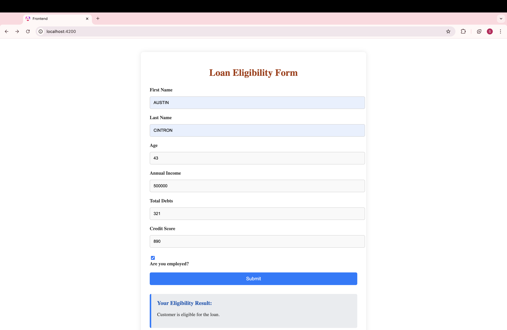

# Loan Management System

## Overview

This project is a Loan Management System that helps manage customer loan applications and eligibility checks. The frontend is developed using Angular 14, TypeScript, HTML, CSS, and Node.js, while the backend is powered by Java Spring Boot and Maven, with a MySQL database.

## Features

- Customer loan application form
- Loan eligibility check
- Responsive UI
- Error handling and validation
- RESTful API integration

## Technologies Used

### Frontend

- **Angular 14**
- **TypeScript**
- **HTML**
- **CSS**
- **Node.js**

### Backend

- **Java Spring Boot**
- **Maven**
- **MySQL Database**

### Tools

- **Postman** (for API testing and debugging)

## Setup and Installation

### Prerequisites

- Node.js (latest version recommended)
- Angular 14
- Java 11
- Maven
- MySQL Server

### Frontend

1. **Clone the repository:**

   ```bash
   git clone https://github.com/boddulurisrisai/loan-management-system.git
   ```

2. **Navigate to the frontend directory:**

   ```bash
   cd LoanManagement/frontend
   ```

3. **Install the dependencies:**

   ```bash
   npm install
   ```

4. **Run the Angular application:**

   ```bash
   ng serve
   ```

5. **Open your browser and navigate to:**
   ```
   http://localhost:4200
   ```

### Backend

1. **Navigate to the backend directory:**

   ```bash
   cd LoanManagement/backend/loan-eligibility
   ```

2. **Install Maven dependencies:**

   ```bash
   mvn clean install
   ```

3. **Configure the MySQL database:**

   - Import database named `sakila`.
   - Update the `application.properties` file with your MySQL database credentials.

4. **Run the Spring Boot application:**

   ```bash
   mvn spring-boot:run
   ```

5. **The backend will be available at:**
   ```
   http://localhost:8080
   ```

## API Endpoints

### Check Customer Eligibility

- **URL:** `/api/loans/check-customer`
- **Method:** `POST`
- **Description:** Checks the loan eligibility of a customer. If the customer is not present in the database, the response will indicate that the customer is not in the database. If the customer is present, the backend will check the provided details to determine whether the customer is eligible for a personal loan of $5000.
- **Request Body:**
  ```json
  {
    "firstName": "John",
    "lastName": "Doe",
    "age": 30,
    "annualIncome": 75000,
    "creditScore": 700,
    "existingDebts": 10000,
    "employmentStatus": "Employed"
  }
  ```
- **Response (Customer Not in Database):**
  ```json
  {
    "message": "Customer not found in database."
  }
  ```
- **Response (Customer Eligible for Loan):**
  ```json
  {
    "message": "Eligible for loan."
  }
  ```
- **Response (Customer Not Eligible for Loan):**
  ```json
  {
    "message": "Not eligible for loan."
  }
  ```

## Testing

Use Postman to test the API endpoints.

## Loan Eligibility Form

Here is a screenshot of the Loan Eligibility Form:




