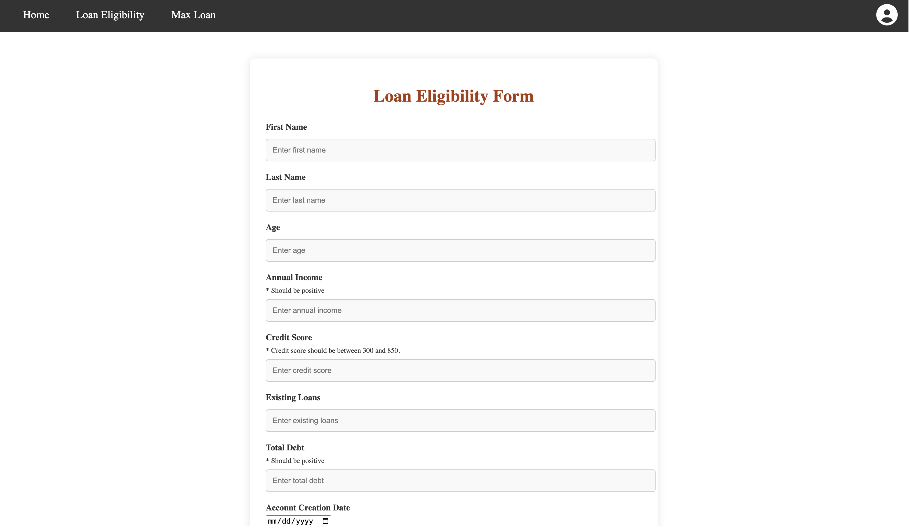
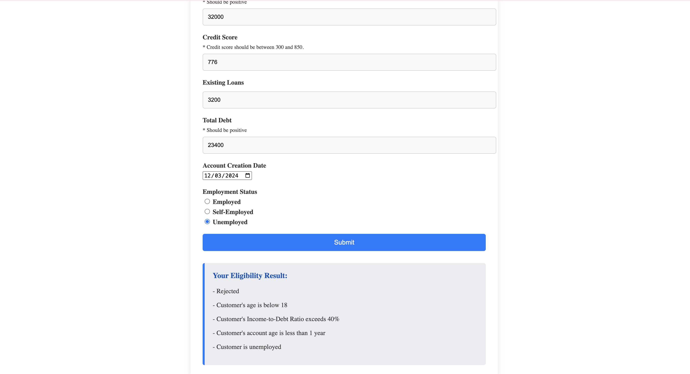
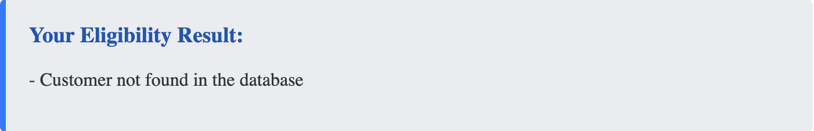
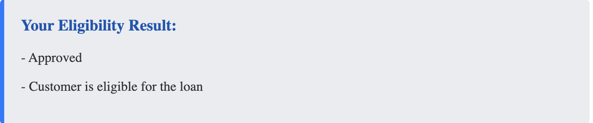
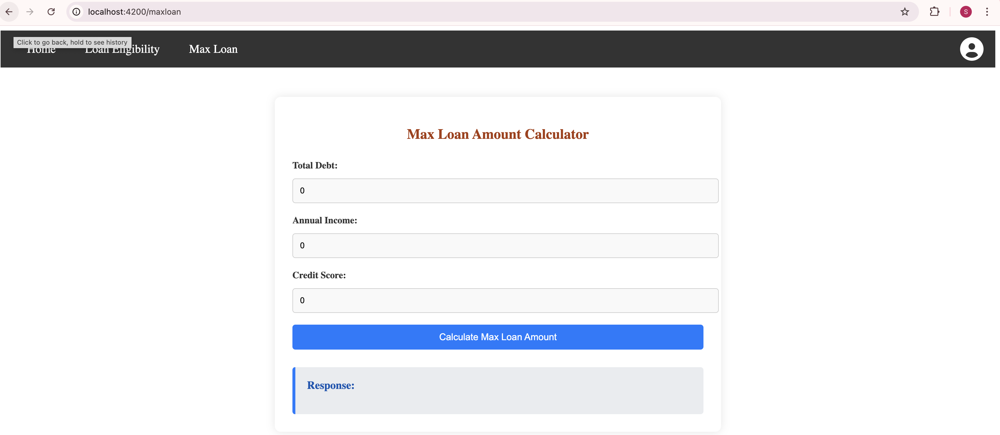
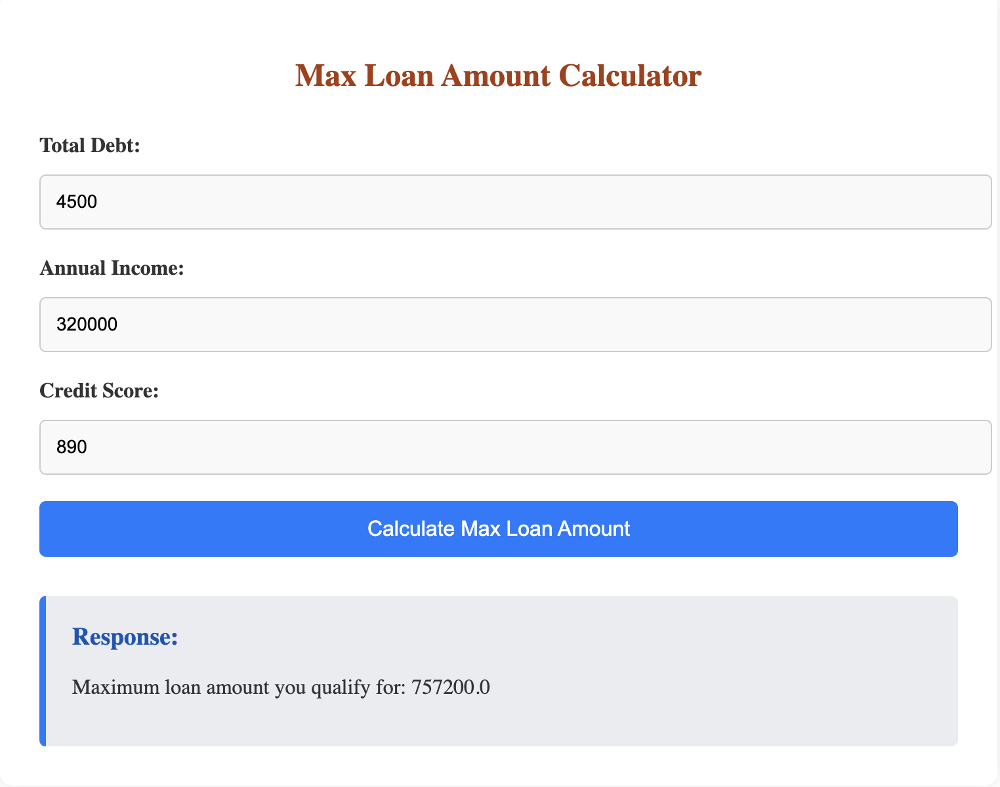

# Loan Metrics

## Overview

This project is a Loan Management System that helps manage customer loan applications and eligibility checks. The frontend is developed using Angular 14, TypeScript, HTML, CSS, and Node.js, while the backend is powered by Java Spring Boot and Maven, with a MySQL database. The entire application is containerized using Docker and deployed on Render for global accessibility.

## Features

- Customer loan application form
- Loan eligibility check
- Max loan amount calculator
- Responsive UI
- Error handling and validation
- RESTful API integration
- Fully containerized setup

## Technologies Used

### Frontend

- **Angular 14**
- **TypeScript**
- **HTML**
- **CSS**
- **Node.js**

### Backend

- **Java Spring Boot**
- **Maven**
- **MySQL Database**

### Tools

- **Postman** (for API testing and debugging)
- **Docker** (for containerization)
- **Render** (for deployment)

## Setup and Installation

### Prerequisites

- Docker
- Node.js
- Angular 14
- Java 11
- Maven

### Dockerized Setup

1. **Clone the repository:**

   ```bash
   git clone https://github.com/boddulurisrisai/loan-management-system.git
   ```

2. **Build the Docker images:**

   Navigate to the root directory of the project where the `Dockerfile` for both frontend and backend are located. Then run the following commands:

   ```bash
   # Build the frontend image
   docker build -t loan-management-frontend ./LoanManagement/frontend

   # Build the backend image
   docker build -t loan-management-backend ./LoanManagement/backend/loan-eligibility
   ```

3. **Push the images to Docker Hub:**

   Make sure you are logged in to Docker Hub and push the images:

   ```bash
   docker tag loan-management-frontend <your-dockerhub-username>/loan-management-frontend
   docker push <your-dockerhub-username>/loan-management-frontend

   docker tag loan-management-backend <your-dockerhub-username>/loan-management-backend
   docker push <your-dockerhub-username>/loan-management-backend
   ```

4. **Deploy on Render:**

   - Use the pushed Docker images to configure your Render services for both the frontend and backend.
   - Configure environment variables for the backend service, including MySQL credentials.

5. **Access the Application:**

   Once deployed, the application will be globally accessible through the URLs provided by Render.

### Local Setup

For local development and testing, follow these steps:

#### Frontend

1. **Navigate to the frontend directory:**

   ```bash
   cd LoanManagement/frontend
   ```

2. **Install the dependencies:**

   ```bash
   npm install
   ```

3. **Run the Angular application:**

   ```bash
   ng serve
   ```

4. **Open your browser and navigate to:**
   ```
   http://localhost:4200
   ```

#### Backend

1. **Navigate to the backend directory:**

   ```bash
   cd LoanManagement/backend/loan-eligibility
   ```

2. **Install Maven dependencies:**

   ```bash
   mvn clean install
   ```

3. **Configure the MySQL database:**

   - Import the database named `sakila`.
   - Update the `application.properties` file with your MySQL database credentials.

4. **Run the Spring Boot application:**

   ```bash
   mvn spring-boot:run
   ```

5. **The backend will be available at:**
   ```
   http://localhost:8080
   ```

## API Endpoints

### Check Customer Eligibility

- **URL:** `/api/loans/check-customer`
- **Method:** `POST`
- **Description:** Checks the loan eligibility of a customer. If the customer is not present in the database, the response will indicate that the customer is not in the database. If the customer is present, the backend will check the provided details to determine whether the customer is eligible for a personal loan of $5000.
- **Request Body:**
  ```json
  {
    "firstName": "John",
    "lastName": "Doe",
    "age": 30,
    "annualIncome": 75000,
    "creditScore": 700,
    "existingDebts": 10000,
    "employmentStatus": "Employed"
  }
  ```
- **Response (Customer Not in Database):**
  ```json
  {
    "message": "Customer not found in database."
  }
  ```
- **Response (Customer Eligible for Loan):**
  ```json
  {
    "message": "Eligible for loan."
  }
  ```
- **Response (Customer Not Eligible for Loan):**
  ```json
  {
    "message": "Not eligible for loan."
  }
  ```

### Calculate Maximum Loan Amount

- **URL:** `/api/loans/calculate-max-loan`
- **Method:** `POST`
- **Description:** Calculates the maximum loan amount a customer can receive based on their annual income, credit score, and total debt.
- **Request Body:**
  ```json
  {
    "annualIncome": 75000,
    "creditScore": 700,
    "totalDebt": 10000
  }
  ```
- **Response Example:**
  ```json
  {
    "maxLoanAmount": 50000
  }
  ```

## Testing

Use Postman to test the API endpoints.

## Loan Eligibility Form

Here is a screenshot of the Loan Eligibility Form:






## Max Loan Amount Calculator Form

A new page has been added to allow users to calculate the maximum loan amount they can receive. This page uses the `/api/loans/calculate-max-loan` endpoint to process user input and display the calculated maximum loan amount.

Here is a screenshot of the Max Loan Amount Calculator Form:




